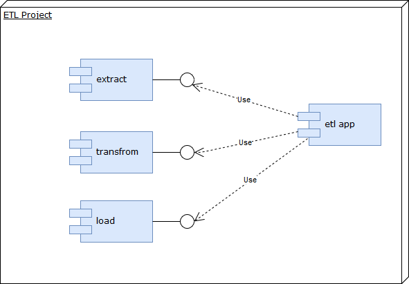

Architecture
============
In general whole application architecture mainly bases on ETL pattern.
In result, application code has been divided into modules implement that idea.

User interface architecture is hidden inside Kivy.
Kivy in general uses MVC (Model-View-Controller) architectural patten.
To be coherent with MVC idea also kivy language (files .kv) is in use for Views separation from logic.

Data Model
----------
Data model present in database (generated by Phony ORM) is coherent with "Transform" part:

.. image:: assets/etl.png

