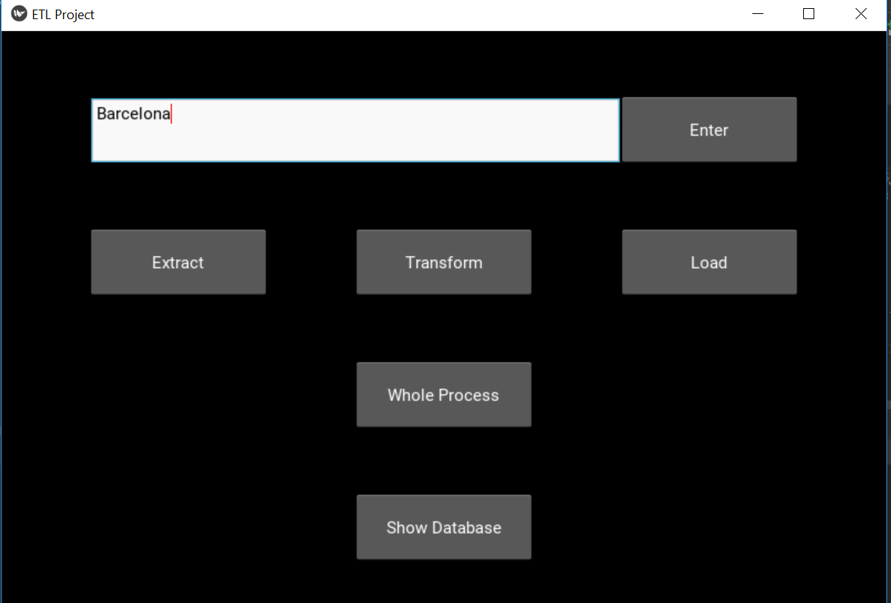

============
User Manual
============

ETL Project application collecting all user reviews from given hotel.
Hotels and reviews data are read from travel fare aggregator website Booking.com (https://www.booking.com).
Collected Data are stored into MySql database and are displayed also in application.

Installation
------------
Application requires Python environment in version 3.6+. Firefox 63.0+ web browser is             also required, in case of malfunction (exceptions about lack of access to this binary), please add firefox.exe binary path to system PATH.
Application require additional python packages listed in appendix.

Python script dependecy_installer.py installs automatically all necessary packages.

Installing mysql is required, and  "root" named user with password "root" must be present.

How to start application
------------------------
Application is started as Python application by following command::

    <path to>\python.exe <path to etl>etl.py

In result such main window shall appear:

Features description
--------------------
Application is combined from following features:
    - Hotel choosing dialog
    - Extraction
    - Transform
    - Load
    - Presentation and filtering dialog

Hotel choosing dialog
~~~~~~~~~~~~~~~~~~~~~
This dialog gives possibility of choice hotel form 10 hotels in given city.

Extraction
~~~~~~~~~~
Extraction functionality analyse web site content and collects all hotel and review information as XMLS.
Selenium web driver as a driver engine and Beautiful soup as XML parser are use.

Requires that hotel is defined in Hotel choosing dialog.

Transform
~~~~~~~~~
Transform functionality receives data from extraction module (in XML form)
 and transforming them info format acceptable by load module (Pony ORM  format).

Requires data from Extract.

Load
~~~~
Load functionality is dedicated for load data into database.
In general all operations on database are implemented in this module.

This functionality is implemented by usage Pony Object Relation Mapper (ORM).

Requires data from Transform.

Presentation and filtering dialog
~~~~~~~~~~~~~~~~~~~~~~~~~~~~~~~~~
This dialog contains following features:
    - shows data from database for given hotel
    - choice hotel and expose them data
    - delete all reviews from database (for given hotel)
    - export data to CSV file, all reviews for given hotel, or only one review
    - filtering data in exposed table, as a pattern can be use also string with wildcard (%).

Use scenarios description
-------------------------
For just collecting data from web two possible scenarios are possible:

    - ETL process divided by separated actions.

        - Choose city.

        .. image:: assets/example_city_enter.png

        - Choice hotel.

        .. image:: assets/example_city_select.png

        - Extract reviews from hotel.

        .. image:: assets/extract.png

        - Transform data.

        .. image:: assets/transform.png

        - Load into database.

        .. image:: assets/load.png

        - Expose data.

        .. image:: assets/database_content_simple.png

    - one ETL process as one action.

        - Choose city.

        .. image:: assets/example_city_enter.png

        - Click Whole process button

        .. image:: assets/whole.png

        - Expose data.

        .. image:: assets/database_content_simple.png

Application's Menus and Views description
-----------------------------------------

- Main application window:
    .. image:: assets/main.png

- Setup city dialog:
    City can be defined be enter city name:

    .. image:: assets/city_text_box.png

    Button "Enter" accepts city choice:

    .. image:: assets/city_enter.png

    If city with that name exist, list of no more then 10 most commented hotels appears.
    One of them can be selected, and accepted by button "Confirm" .

     .. image:: assets/example_city_select.png

- Extract Button
    When hotel has been chosen then extract of review data is possible:

    .. image:: assets/extract.png

    During this process, modal dialog is visible and then button "OK" is not active:

    .. image:: assets/modal_processing_extract.png

    When process ends, then button "OK" becomes active and ifo about number of processed records is visible:

    .. image:: assets/modal_end.png

- Transform Button
     When Extract process has been successfully done then transform of review data is possible:

    .. image:: assets/transform.png

    During this process, modal dialog is visible and then button "OK" is not active:

    .. image:: assets/modal_processing_transform.png

    When process ends, then button "OK" becomes active and ifo about number of processed records is visible:

    .. image:: assets/modal_end.png

- Load
    When Extract process has been successfully done then transform of review data is possible:

    .. image:: assets/load.png

    During this process, modal dialog is visible and then button "OK" is not active:

    .. image:: assets/modal_processing_load.png

    When process ends, then button "OK" becomes active and ifo about number of processed records is visible:

    .. image:: assets/modal_end.png

- Whole process
    When hotel has been chosen then also whole ETL process of review data is possible:

    .. image:: assets/whole.png

     During this process, modal dialog is visible and then button "OK" is not active:

    .. image:: assets/modal_processing_whole.png

    When process ends, then button "OK" becomes active and ifo about number of processed records is visible:

    .. image:: assets/modal_end.png

- Presenting and filtering database dialog:
    Displaying database content for one hotel

    .. image:: assets/show_database.png

    - Hotel choice button allow to choice hotel, data in table are loaded automatically after choice:

    .. image:: assets/database_content_hotel_data.png

    - Export CSV buttons, exports all data from given hotel

    .. image:: assets/database_content_export_to_cvs.png

    or only for one review ID if set:

    .. image:: assets/database_content_export_to_cvs_by_ID.png

    - Filtering tab, when Apply button is clicked table content is filtered (% wildcard allowed):

    .. image:: assets/database_content_filter.png

    - Delete Reviews button, if clicked removes all review for given hotel:

    .. image:: assets/database_content_delete_all.png

    - Close button, just close dialog:

    .. image:: assets/database_content_close.png

